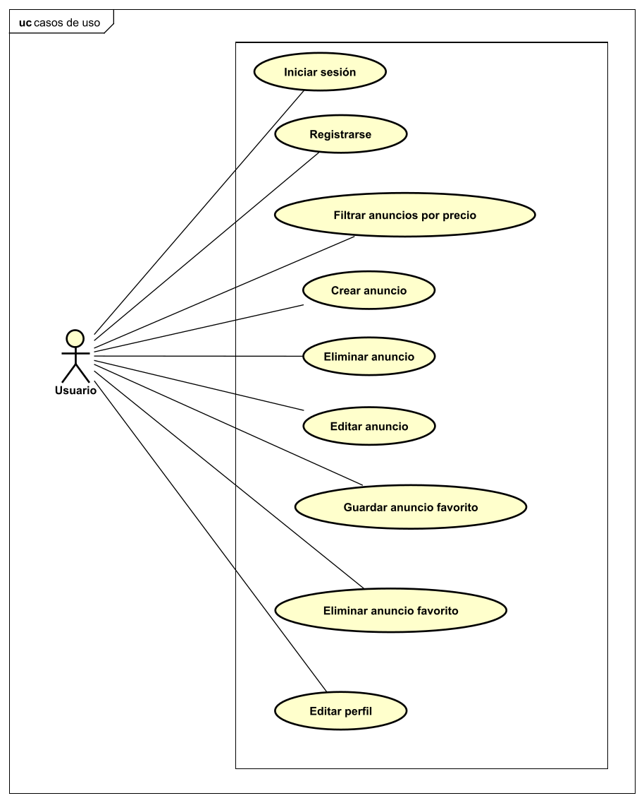
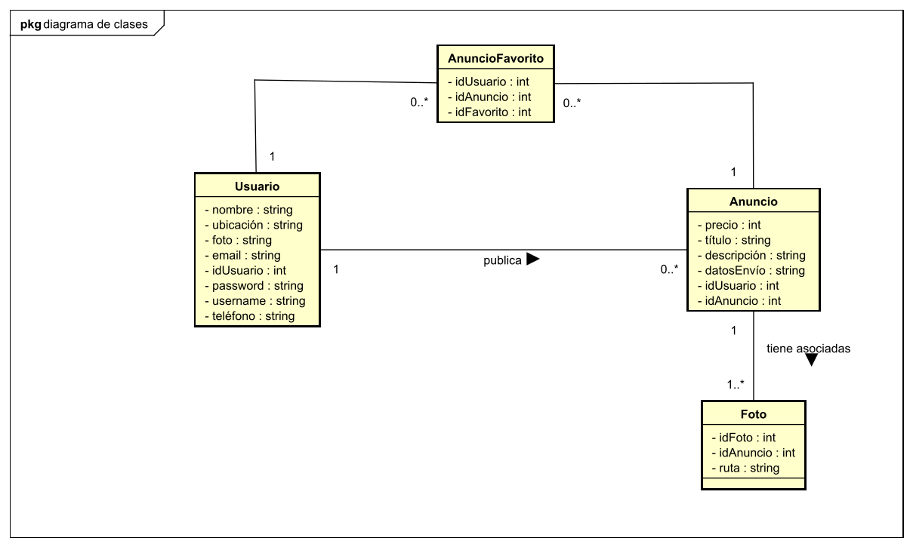
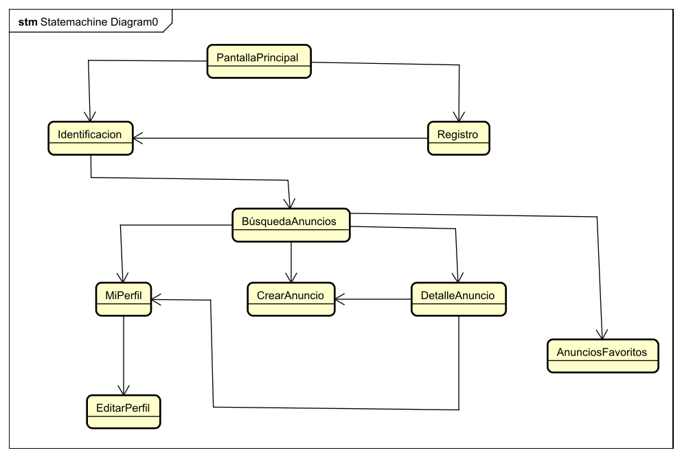

<h1>Documento resumen del proyecto para crear la aplicación "EnesimaMano"</h1>

<ol>
<h2><li>Resumen del proyecto</li></h2>

Esta aplicación servirá para publicar anuncios para vender objetos de usados. Los usuarios una vez se identifiquen podrán ver los últimos anuncios publicados y podrán filtrarlos por precio. Los usuarios podrán subir anuncios añadiendo fotos, un título, un precio y una descripción. Además los usuarios podrán editar sus anuncios publicados o eliminarlos.

<h2><li>Aplicaciones similares</li></h2>

Destacan dos aplicaciones similares en las que se basará este proyecto:

<ul>
<li>Wallapop</li>
<li>Milanuncios</li>
</ul>
<h2><li>Tecnologías utilizadas</li></h2>

Las tecnologías utilizadas para el desarrollo de este proyecto son:

<ul>
<li>Frontend: Angular</li>
<li>Backend: Spring Boot</li>
<li>Base de datos: Firebase</li>
</ul>
<h2><li>Funcionalidad de la aplicación. Casos de uso</li></h2>

A continuación se expone el diagrama de casos de uso de la aplicación:

<h2><li>Diagrama de clases</li></h2>

A continuacion se expone el diagrama de clases de la aplicación:

<h2><li>Estructura de la base de datos</li></h2>

A continuación se expone el diagrama con las relaciones entre las tablas de la base de datos de la aplicación:

<h2><li>Estructura del backend</li></h2>

La estructura del backend va a consistir en una API REST creada con Spring Boot para acceder a los datos almacenados en la base de datos. Se han creado controladores, servicios y DTO para gestionar los accesos a las tablas de la base de datos, de manera que todas las operaciones sobre una determinada tabla se agrupan en un servicio. A estas operaciones se accede por su controlador asociado y los datos gestionados se controlan con el DTO correspondiente. Las clases que tienen un controlador, un servicio y DTO correspondiente en Spring boot para gestionar los datos de sus correspondientes tablas de la base de datos son:

<ul>
<li>Usuario</li>
<li>Favorito</li>
<li>Foto</Li>
<li>Anuncio</Li>

</ul>

<h2><li>Estructura del frontend</li></h2>
La aplicación contará con las siguientes vistas:
<ul>
<li>PantallaPrincipal: esta vista funcionará como una landing page</li>
<li>Identificación: esta vista contará con un formulario para que el usuario se identifique</li>
<li>Registro: esta vista contará con un formulario para que el usuario se registre</li>
<li>BúsquedaAnuncios: esta vista mostrará todos los anuncios publicados y permitirá al usuario aplicar filtros y realizar búsquedas</li>
<li>MiPerfil: esta vista mostrará los datos del usuario y sus anuncios</li>
<li>EditarPerfil: en esta vista el usuario podrá editar los datos de su cuenta</li>
<li>CrearAnuncio: en esta vista el usuario podrá crear un anuncio rellenando un formulario o editar los datos del anuncio</li>
<li>DetallesAnuncio: en esta vista se podrán ver los detalles de un anuncio.</li>
<li>AnunciosFavoritos: en esta vista aparecerán los anuncios favoritos del usuario</li>

La navegación entre las diferentes vistas en la siguiente:

</ul>
<h2><li>Bocetos del frontend</li></h2>
Se han realizado bocetos con Figma con la idea básica de como será la aplicación. Estos bocetos han servido de guía para el desarrollo de la aplicación, sin embargo durante el desarrollo se han encontrado mejoras sobre estos bocetos. Por lo tanto el resultado final, combina los bocetos con ideas aparecidas durante el desarrollo. Los bocetos se encuentran en el pdf adjunto enesimamano-bocetos.
<h2><li>Detalles de la aplicacion</li></h2>
<ul>
<li>Icono: </li>

<li>Colores:
<ul>
<li>Azul verdoso oscuro:#11B780</li>
<li>Azul verdoso claro:#12E19C</li>
<li>Blanco:#FFFFFF</li>
</ul>
</li>
</ul>
<h2><li>Registro del tiempo</li></h2>

El registro del tiempo es algo fundamental debido a la cantidad de tareas por realizar, además de este proyecto. Por lo tanto se definirá en la siguiente tabla la fecha, la hora de inicio, la hora final, el tiempo utilizado y una descripción de cada tarea realizada y cada trabajo realizado en el proyecto. Además este registro del tiempo sirve para estimar el tiempo de realización para trabajos futuros y para controlar que el esfuerzo en este proyecto no exceda los límites aceptables. 

<table>
<tr>
    <th>Fecha</th>
    <th>Hora de inicio</th>
    <th>Hora final</th>
    <th>Tiempo utilizado (en minutos)</th>
    <th>Descripción del trabajo realizado</th>
  </tr>
  <tr>
    <td>Jueves 4 de mayo</td>
    <td>17:45</td>
    <td>18:00</td>
    <td>15</td>
    <td>Realizar primeras partes documento resumen</td>
  </tr>

  <tr>
    <td>Jueves 4 de mayo</td>
    <td>21:25</td>
    <td>21:55</td>
    <td>30</td>
    <td>Realizar documento resumen</td>
  </tr>

  <tr>
    <td>Jueves 4 de mayo</td>
    <td>22:35</td>
    <td>23:20</td>
    <td>45</td>
    <td>Realizar primeras partes documento resumen</td>
  </tr>
  <tr>
    <td>Viernes 5 de mayo</td>
    <td>20:45</td>
    <td>21:40</td>
    <td>55</td>
    <td>Realizar documento resumen</td>
  </tr>

  <tr>
    <td>Viernes 5 de mayo</td>
    <td>22:15</td>
    <td>23:30</td>
    <td>75</td>
    <td>Realizar landing page</td>
  </tr>

  <tr>
    <td>Sabado 6 de mayo</td>
    <td>18:10</td>
    <td>21:50</td>
    <td>220</td>
    <td>Realizar interfaces</td>
  </tr>

  <tr>
    <td>Domingo 7 de mayo</td>
    <td>8:15</td>
    <td>11:20</td>
    <td>185</td>
    <td>Realizar backend Spring boot</td>
  </tr>

  <tr>
    <td>Domingo 7 de mayo</td>
    <td>11:40</td>
    <td>12:00</td>
    <td>20</td>
    <td>Backend</td>
  </tr>

  <tr>
    <td>Domingo 7 de mayo</td>
    <td>13:55</td>
    <td>14:30</td>
    <td>35</td>
    <td>Problema fotos</td>
  </tr>

  <tr>
    <td>Domingo 7 de mayo</td>
    <td>15:30</td>
    <td>18:40</td>
    <td>190</td>
    <td>Fotos Firebase</td>
  </tr>

   <tr>
    <td>Domingo 7 de mayo</td>
    <td>19:40</td>
    <td>20:45</td>
    <td>65</td>
    <td>Parte Angular</td>
  </tr>

   <tr>
    <td>Domingo 7 de mayo</td>
    <td>21:10</td>
    <td>21:25</td>
    <td>15</td>
    <td>Parte Angular</td>
  </tr>

   <tr>
    <td>Domingo 7 de mayo</td>
    <td>23:15</td>
    <td>0:00</td>
    <td>45</td>
    <td>Parte Angular</td>
  </tr>

   <tr>
    <td>Lunes 8 de mayo</td>
    <td>9:00</td>
    <td>9:40</td>
    <td>40</td>
    <td>Parte Angular</td>
  </tr>

   <tr>
    <td>Lunes 8 de mayo</td>
    <td>21:10</td>
    <td>22:05</td>
    <td>55</td>
    <td>Backend Spring boot</td>
  </tr>

  <tr>
    <td>Lunes 8 de mayo</td>
    <td>22:40</td>
    <td>0:30</td>
    <td>110</td>
    <td>Parte Angular</td>
  </tr>

  <tr>
    <td>Martes 9 de mayo</td>
    <td>9:00</td>
    <td>9:25</td>
    <td>25</td>
    <td>Parte Angular</td>
  </tr>

  <tr>
    <td>Martes 9 de mayo</td>
    <td>12:40</td>
    <td>14:20</td>
    <td>100</td>
    <td>Parte Angular</td>
  </tr>

  <tr>
    <td>Martes 9 de mayo</td>
    <td>17:00</td>
    <td>19:05</td>
    <td>125</td>
    <td>Problema fotos</td>
  </tr>

   <tr>
    <td>Martes 9 de mayo</td>
    <td>20:40</td>
    <td>20:50</td>
    <td>10</td>
    <td>Problema fotos</td>
  </tr>

   <tr>
    <td>Martes 9 de mayo</td>
    <td>22:55</td>
    <td>0:00</td>
    <td>65</td>
    <td>Problema fotos</td>
  </tr>

   <tr>
    <td>Miercoles 10 de mayo</td>
    <td>23:25</td>
    <td>0:00</td>
    <td>35</td>
    <td>Problema fotos</td>
  </tr>

   <tr>
    <td>Jueves 11 de mayo</td>
    <td>17:15</td>
    <td>19:30</td>
    <td>135</td>
    <td>Revisiones</td>
  </tr>

   <tr>
    <td>Jueves 11 de mayo</td>
    <td>23:00</td>
    <td>0:20</td>
    <td>80</td>
    <td>Revisiones</td>
  </tr>

  <tr>
    <td>Sabado 13 de mayo</td>
    <td>9:00</td>
    <td>11:20</td>
    <td>140</td>
    <td>Revisiones</td>
  </tr>

  <tr>
    <td>Sabado 13 de mayo</td>
    <td>11:35</td>
    <td>12:10</td>
    <td>35</td>
    <td>Revisiones</td>
  </tr>

  <tr>
    <td>Sabado 13 de mayo</td>
    <td>13:40</td>
    <td>14:30</td>
    <td>50</td>
    <td>Revisiones</td>
  </tr>

  <tr>
    <td>Sabado 13 de mayo</td>
    <td>15:20</td>
    <td>17:20</td>
    <td>120</td>
    <td>Revisiones</td>
  </tr>
  
  
</table>

<strong>Tiempo empleado: 2120 minutos (35 horas y 20 minutos)</strong>

<h2><li>Resultado final: vídeo youtube y repositorio</li></h2>
Repositorio Github:

<h2><li>Conclusiones</li></h2>
He aprendido a crear una aplicación responsive utilizando solo CSS mediante media queries. He aprendido a utilizar una nueva base de datos no relacional como es Firebase y a utilizar en el backend Spring boot para acceder a sus datos. He aplicado nuevos conceptos sobre Angular y que hacen que la aplicación tenga más utilidad. Además hacer que la aplicación almacene las fotos en Firebase ha sido un gran reto. 

</ol>